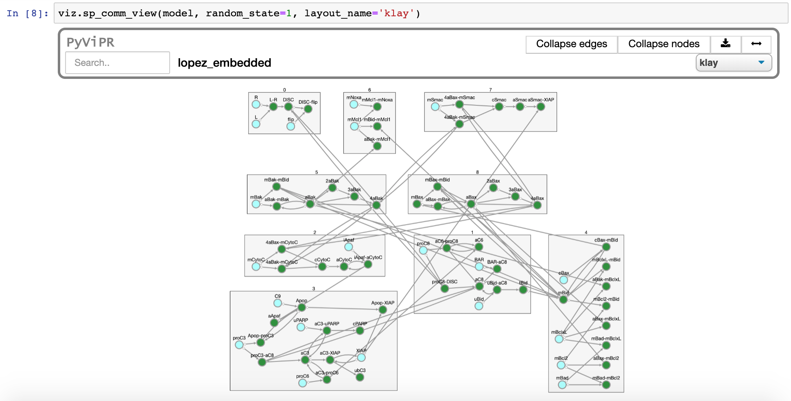
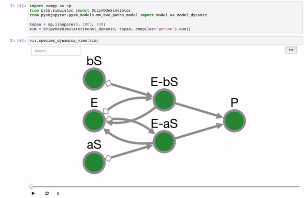
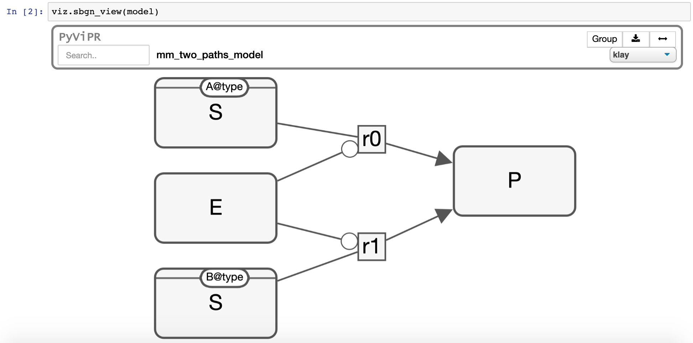

# 


[](https://pyvipr.readthedocs.io/en/latest/?badge=latest)
[](https://travis-ci.org/LoLab-VU/pyvipr)
[](https://mybinder.org/v2/gh/LoLab-VU/pyvipr/master?filepath=docs%2Ftutorial.ipynb)
# PyViPR
PyViPR is a Jupyter widget for dynamic and static visualizations of [PySB](http://pysb.org/), 
[BNGL](https://www.csb.pitt.edu/Faculty/Faeder/?page_id=409), and [SBML](http://sbml.org/Main_Page) 
 models using cytoscapejs. Additionally, it can be used to visualize models defined in [Tellurium](https://github.com/sys-bio/tellurium#front-end-2-tellurium-notebook),
 and [Ecell4](https://github.com/ecell/ecell4),

## Installation

### From conda

#### To use with Jupyter Notebooks:

```bash
> conda install pyvipr -c ortegas -c alubbock
```

#### To use with JupyterLab:

```bash
> conda install pyvipr -c ortegas -c alubbock
> jupyter labextension install @jupyter-widgets/jupyterlab-manager
> jupyter labextension install pyvipr
```

### From PyPI

#### To use with Jupyter Notebooks:

```bash
> pip install pyvipr
```

#### To use with JupyterLab:

```bash
> pip install pyvipr
> jupyter labextension install @jupyter-widgets/jupyterlab-manager
> jupyter labextension install pyvipr
```

When using pip the [installation of PySB](https://pysb.readthedocs.io/en/stable/installation.html#option-1-install-pysb-natively-on-your-computer)
requires to manually install BioNetGen into the default path for your platform 
(/usr/local/share/BioNetGen on Mac and Linux, c:\Program Files\BioNetGen on Windows), 
or set the BNGPATH environment variable to the BioNetGen path on your machine.

### From git (requires npm)
```bash
$ git clone https://github.com/LoLab-VU/pyvipr.git
$ cd pyvipr
$ pip install .
```

## How to use the widget
After installing the widget, it can be used by importing it in the notebook. The widget is simple to use with PySB 
models, [SimulationResult](https://pysb.readthedocs.io/en/stable/modules/simulator.html#pysb.simulator.SimulationResult) 
objects, and BNGL & SBML files. PyViPR has the following visualization functions:

| Function                                 | Description                                           |
|------------------------------------------|-------------------------------------------------------|
| `sp_view(model)`                    | Shows network of interacting species                  |
| `sp_comp_view(model)`       | Shows network of species in their respective compartments |
| `sp_comm_view(model)`                | Shows network of species grouped in [communities](https://en.wikipedia.org/wiki/Community_structure) |
| `sp_rxns_bidirectional_view(model)`      | Shows bipartite network with species and bidirectional reactions nodes |
| `sp_rxns_view(model)`                    | Shows bipartite network with species and unidirectional reactions nodes |
| `sp_rules_view(model)`                   | Shows bipartite network with species and rules nodes  |
| `sp_rules_fxns_view(model)`         | Shows bipartite network with species and rules nodes.<br> Rules nodes are grouped in the functions they come from |
| `sp_rules_mod_view(model)`           | Shows bipartite network with species and rules nodes.<br> Rules nodes are grouped in the file modules they come from |
| `projected_species_reactions_view(model)`| Shows network of species projected from the <br> bipartite(species, reactions) graph |
| `projected_reactions_view(model)`        | Shows network of reactions projected from the <br> bipartite(species, reactions) graph |
| `projected_rules_view(model)`            | Shows network of rules projected from the <br> bipartite(species, rules) graph |
| `projected_species_rules_view(model)`    | Shows network of species projected from the <br> bipartite(species, rules) graph |
| `sp_dyn_view(SimulationResult)`| Shows a species network. Edges size and color are updated <br> according to reaction rate values. Nodes filling <br> are updated according to concentration|
| `sp_comp_dyn_view(SimulationResult)` | Same as sp_dyn_view but species nodes are grouped by <br> the compartments on which they are located |
| `sp_comm_dyn_view(SimulationResult)` | Same as sp_dyn_view but species nodes are grouped by communities |
| `sim_model_dyn_view(model, tspan, param_values)` | Simulates a model a shows a dynamic visualization of the results |
| `nx_graph_view(graph)` | Shows a networkx graph |
| `nx_graph_dyn_view(graph, tspan, **kwargs)`| Shows a dynamic visualization of the graph |

All visualizations have a search button that can be used to find nodes in large networks. This search function displays 
information about the node label and the type of node (species, reaction, rule, ...). Additionally, there is a fit 
button to center the nodes into the display area. It is possible to zoom in to a node or o collection of nodes
using box selection (modifier key(command, alt, ctrl) + mousedown then drag)
  
Static Example:
```python
import pyvipr as viz
from pyvipr.pysb_models.lopez_embedded import model

viz.sp_view(model)
```



Dynamic Example:
```python
import pyvipr as viz
from pyvipr.pysb_models.mm_two_paths_model import model
from pysb.simulator import ScipyOdeSimulator
import numpy as np

tspan = np.linspace(0, 1000, 100)
sim = ScipyOdeSimulator(model, tspan).run()
viz.sp_dyn_view(sim)
```



PyViPR now has basic support for the SBGN standard:
```python
from pyvipr.pysb_models.mm_two_paths_model import model
import pyvipr as viz

viz.sbgn_view(model)
```



## License

[MIT](https://opensource.org/licenses/MIT)
