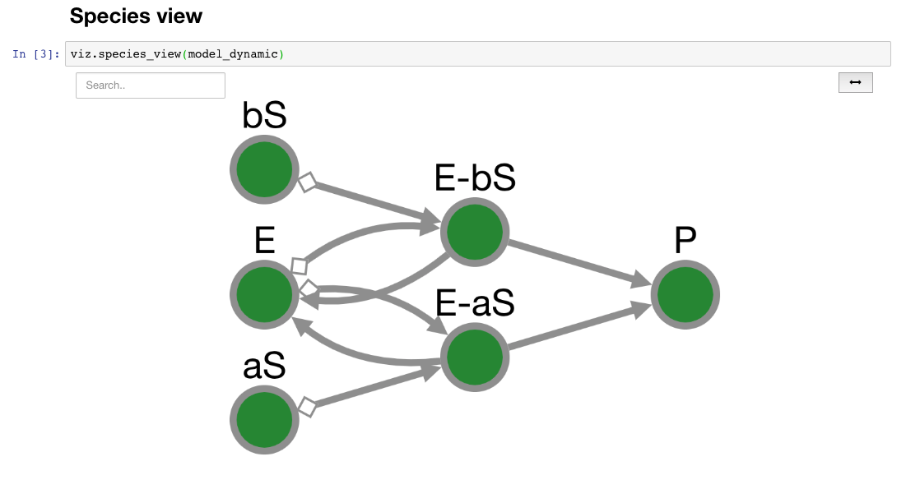

[](https://pyvipr.readthedocs.io/en/latest/?badge=latest)
[](https://travis-ci.org/LoLab-VU/pyvipr)
[](https://mybinder.org/v2/gh/LoLab-VU/pyvipr/master?filepath=docs%2Ftutorial.ipynb)
# pyvipr
Dynamic and static visualizations of [PySB](http://pysb.org/) models using cytoscapejs, It is based on the 
[cytoscape-jupyter-widget](https://github.com/idekerlab/cytoscape-jupyter-widget)

## Installation

### From PyPI

To install this widget, use _pip_:

```bash
# Install the widget from PyPI repository
> pip install pyvipr

# Enable it
> jupyter nbextension enable --py --sys-prefix pyvipr
```
### From git (requires npm)
```bash
$ git clone https://github.com/LoLab-VU/pyvipr.git
$ cd pyvipr
$ pip install .
$ jupyter nbextension enable --py --sys-prefix pyvipr
```

## How to use the widget
After installing the widget, it can be used by importing it in the notebook. The widget is simple to use with PySB 
models and [SimulationResult](https://pysb.readthedocs.io/en/stable/modules/simulator.html#pysb.simulator.SimulationResult) 
objects. pyvipr has different functions to visualize PySB models and simulations:

| Function                                 | Description                                           |
|------------------------------------------|-------------------------------------------------------|
| `sp_view(model)`                    | Shows network of interacting species                  |
| `sp_comp_view(model)`       | Shows network of species in their respective compartments |
| `sp_comm_view(model)`                | Shows network of species grouped in [communities](https://en.wikipedia.org/wiki/Community_structure) |
| `sp_rxns_bidirectional_view(model)`      | Shows bipartite network with species and bidirectional rections nodes |
| `sp_rxns_view(model)`                    | Shows bipartite network with species and unidirectional rections nodes |
| `sp_rules_view(model)`                   | Shows bipartite network with species and rules nodes  |
| `sp_rules_fxns_view(model)`         | Shows bipartite network with species and rules nodes.<br> Rules nodes are grouped in the functions they come from |
| `sp_rules_mod_view(model)`           | Shows bipartite network with species and rules nodes.<br> Rules nodes are grouped in the file modules they come from |
| `projected_species_reactions_view(model)`| Shows network of species projected from the <br> bipartite(species, reactions) graph |
| `projected_reactions_view(model)`        | Shows network of reactions projected from the <br> bipartite(species, reactions) graph |
| `projected_rules_view(model)`            | Shows network of rules projected from the <br> bipartite(species, rules) graph |
| `projected_species_rules_view(model)`    | Shows network of species projected from the <br> bipartite(species, rules) graph |
| `sp_dyn_view(SimulationResult)`| Shows a species network. Edges size and color are updated <br> according to reaction rate values. Nodes filling <br> are updated according to concentration|
| `sp_comp_dyn_view(SimulationResult)` | Same as sp_dyn_view but species nodes are grouped by <br> the compartments on which they are located |
| `sp_comm_dyn_view(SimulationResult)` | Same as sp_dyn_view but species nodes are grouped by communities |

All visualizations have a search button that can be used to find nodes in large networks. This search function displays 
information about the species label and the type of node (species, reaction, rule, ...). Additionally, there is a fit 
button to center the nodes into the display area. It is possible to zoom in to a node or o collection of nodes
using box selection (modifier key(command, alt, ctrl) + mousedown then drag)
  
Static Example:
```python
import pyvipr as viz
from pyvipr.pysb_models.mm_two_paths_model import model

viz.species_view(model)
```


Dynamic Example:
```python
import pyvipr as viz
from pyvipr.pysb_models.mm_two_paths_model import model
from pysb.simulator import ScipyOdeSimulator
import numpy as np

tspan = np.linspace(0, 1000, 100)
sim = ScipyOdeSimulator(model, tspan).run()
viz.species_dynamics_view(sim)
```


## License

[MIT](https://opensource.org/licenses/MIT)
