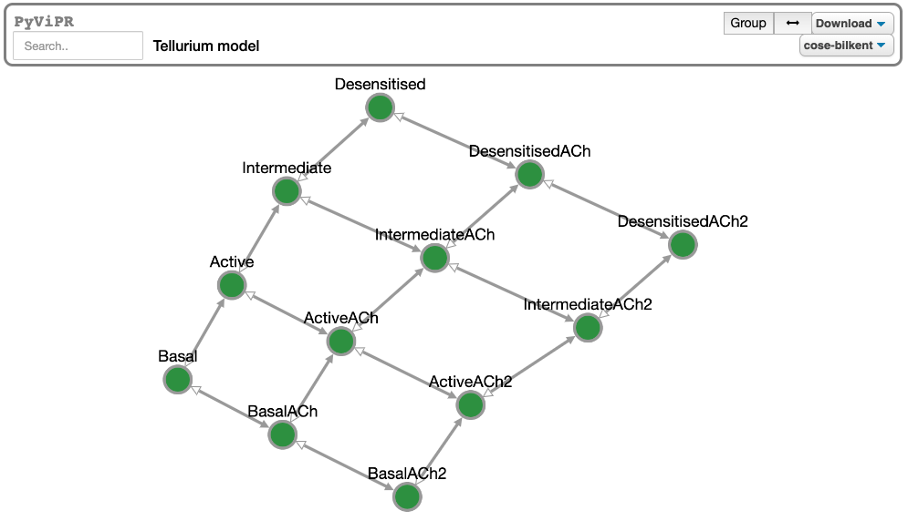

# 


[](https://pyvipr.readthedocs.io/en/latest/?badge=latest)

[](https://mybinder.org/v2/gh/LoLab-VU/pyvipr/master?filepath=binder) 

[](https://gitter.im/LoLab-VU/pyvipr?utm_source=badge&utm_medium=badge&utm_campaign=pr-badge)

# PyViPR
PyViPR is a Jupyter widget that generates network dynamic and static visualizations of [PySB](http://pysb.org/), [Tellurium](http://tellurium.analogmachine.org/),
[BNGL](https://www.csb.pitt.edu/Faculty/Faeder/?page_id=409), [SBML](http://sbml.org/Main_Page), and [Ecell4](https://github.com/ecell/ecell4) 
 models using [Cytoscape.js](http://js.cytoscape.org/). Additionally, it can be used to visualize networks encoded in the graphml, 
 sif, sbgn xml, cytoscape json, gexf, gml and yaml formats.
 
 ## Trying it online

To try out PyViPR interactively in your web browser, just click on the binder
link below:

[](https://mybinder.org/v2/gh/LoLab-VU/pyvipr/master?filepath=binder)

## Installation

### From conda

#### To use with Jupyter Notebooks:

```bash
> conda install pyvipr -c ortegas
```

#### To use with JupyterLab:

```bash
> conda install pyvipr -c ortegas
> jupyter labextension install @jupyter-widgets/jupyterlab-manager
> jupyter labextension install pyvipr
```

### From PyPI

#### To use with Jupyter Notebooks:

```bash
> pip install pyvipr
```

#### To use with JupyterLab:

```bash
> pip install pyvipr
> jupyter labextension install @jupyter-widgets/jupyterlab-manager
> jupyter labextension install pyvipr
```

### From git (requires npm)
```bash
$ git clone https://github.com/LoLab-VU/pyvipr.git
$ cd pyvipr
$ pip install .
```

## How to use the widget
After installing the widget, it can be used by importing it in the Jupyter notebook. The widget is simple to use with PySB 
models, [SimulationResult](https://pysb.readthedocs.io/en/stable/modules/simulator.html#pysb.simulator.SimulationResult) 
objects, [Tellurium](http://tellurium.analogmachine.org/) models and BNGL & SBML files. 

PyViPR has three main interfaces: Graph formats, PySB, and a Tellurium.

### Graph formats interface
This interface leverages NetworkX and Cytoscape.js to generate network visualizations of graphs encoded in different 
file formats.

#### Graphml example:
```python
import pyvipr.network_viz as nviz

nviz.graphml_view('path_to_file/mygraph.graphml', layout_name='fcose')
```


### PySB interface

PySB is needed to visualize PySB models and it is needed if you want to use the pyvipr.pysb_viz module:

Installing PySB from pip:
```bash
> pip install pysb
```

When using pip the [installation of PySB](https://pysb.readthedocs.io/en/stable/installation.html#option-1-install-pysb-natively-on-your-computer)
requires to manually install BioNetGen into the default path for your platform 
(/usr/local/share/BioNetGen on Mac and Linux, c:\Program Files\BioNetGen on Windows), 
or set the BNGPATH environment variable to the BioNetGen path on your machine.

Installing PySB from conda:
```bash
> conda install pysb -c alubbock
```

#### PySB static example:
```python
import pyvipr.pysb_viz as pviz
from pyvipr.examples_models.lopez_embedded import model

pviz.sp_comm_louvain_view(model, random_state=1, layout_name='klay')
```


#### PySB Dynamic Example:
```python
import pyvipr.pysb_viz as pviz
from pyvipr.examples_models.mm_two_paths_model import model
from pysb.simulator import ScipyOdeSimulator
import numpy as np

tspan = np.linspace(0, 1000, 100)
sim = ScipyOdeSimulator(model, tspan).run()
pviz.sp_dyn_view(sim)
```


### Tellurium interface

Tellurium is needed to visualize Tellurium models and it is needed if you want to use the pyvipr.tellurium_viz module:

Installing Tellurium from pip:
```bash
> pip install tellurium
```

```python
import tellurium as te
import pyvipr.tellurium_viz as tviz

model = te.loadSBMLModel("https://www.ebi.ac.uk/biomodels-main/download?mid=BIOMD0000000001")

tviz.sp_view(model)
```


## Documentation

To get started with using `PyViPR`, check out the full documentation

https://pyvipr.readthedocs.io/

## Citation
To cite PyViPR, please cite the iScience paper:

[Interactive Multiresolution Visualization of Cellular Network Processes](https://www.cell.com/iscience/fulltext/S2589-0042(19)30493-6)

Ortega O and Lopez C


## License

[MIT](https://opensource.org/licenses/MIT)
